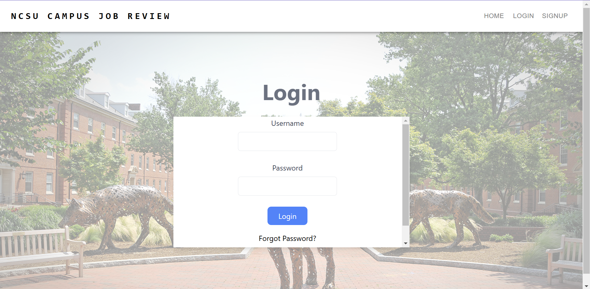
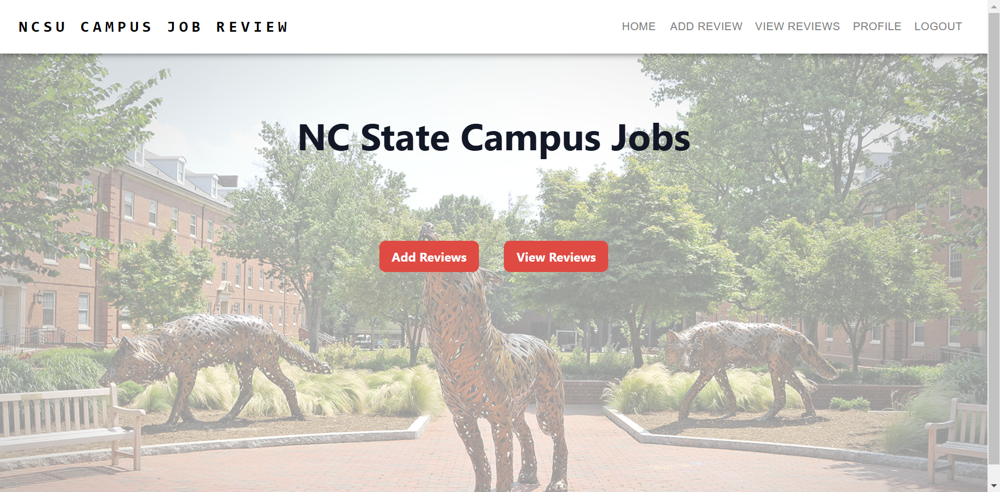

# Use Case Mini Tutorial 

## Welcome to a mini tutorial of our Campus Job Review web application. Here, you will get a detailed view about what to expect in the application, explore the various enhanced features and new functionalities, and look at real-life examples of using the application through screenshots. 

### Landing Page
As you enter our application, you will be greeted by a beautiful home page that truly represents the wolfpack spirit of NCSU. Here you will find various tabs such as the Home, Login, and Signup. You will also see an Add Reviews and a View Reviews Button. 

### Authentication 
The first step as you start your journey of exploring the Campus Job Review web application is to sign up using a username and password. Make sure that your password includes letters and numbers which will make sure that you have the right requirements to sign up successfully. 

Sign Up: The picture below shows the page that opens up when you click the SIGNUP button that is located on the top right corner of the landing page. 

Once you are here, choose a strong username and password to sign up yourself to start using the application. Then, click on the Sign Up button in blue. 

Successful Registration: 
Once you have met the requirements for the username and password, you will see a pop-up indicating a successful registration. It will then tell you to visit the email that you entered to verify email address.

- Verify Email
You will receive an email from the application. Click on the link provided to verify your email address and proceed to the log in process

Failed Registration: 
 Given that a username or email already exists, you will not be able to sign up and will recieve a unsuccessful message. Other cases where you will not be able register successfully include not entering a username or leaving the password empty. An example of a failed registration can be seen in the picture below. 

Login:

Now that you have successfully signed up as a valid user, let us login to the application. You can click on the LOGIN button located at the top right corner which sits in between the HOME and the SIGNUP buttons. Once you click LOGIN, you will be greeted with the following page: 

   It is time to login with the same credentials that you used to sign up. Enter the details and your page will look similar to the image below. 
    
- Successful Login: Given that you have entered a valid username and password based on the details that you used to signup, you will be directed to a new page with new buttoms. The new options available can be seen at the top right corner as "Add Review", "View Reviews", and "LOGOOUT".
     
- Failed Login: Given that you have entered the incorrect username or password, you will see a pop-up explaining that you have entered the invalid credentials. Time to try again!
     

### Add Review
We offer the option for you to add a review to help your peers make informed decisions about the on-campus jobs. You are required to fill in various fields which include Job Title, Department, Location, Job Description, Hourly Pay, Benefits, Rating, Recommendation, and Review. 

The following is an example of the page that you will encounter when you click on the Add Review Button. 
The following image is an example of a valid review with all the fields filled accurately and as expected. 

- Successful completion: Once you have entered all the details without missing any fields, click on the "Submit your review" button at the bottom of the page. Then, you will see a pop-up indicating that you were able to sucessfully add you review. 

- Failed in Adding a Review: Given that you don't fill all the fields that are required in the review form, you will encounter a pop-up telling you that there was an error in submitting your review. This will require you to verify your review again.

    The following image shows an example of a an error when adding a review: 
    

### View Reviews 
When you click on the View Reviews button, you should be able to see the views that were added by your peers and by you, elaborating on the experiences and details about an on-campus job. This page has various sections to give you the most detailed information about a job. These details include the job title, description, department, location, hourly pay, employee benefits, review, rating, recommendation, and a reviewed by column. 

The page should look similar to the following: 
    

### Filter Reviews
We offer an exclusive and easy option for you to filter the reviews based on fields such as Department, Location, and Job Title. Moreover, we also allow you to set a filter on reviews based on the minimum and maximum ratings by your peers. This makes it easier for you to locate the most useful pieces of information in no time. Here is an example of filtering the reviews based on the department. 
    

### Browser Extension
With the integration of a browser API, users will experience enhanced functionality:

Job Review Pop-Ups: When browsing job postings, you will receive pop-ups through our browser extension that currently show the title of the job based on the department title that is associated with the list of reviews on our website. Below are the pictures showing the browser extension functionality. 

### Logout
Once you have explored all the reviews or added reviews, you can log out while making sure that all your changes are saved. This adds another layer of security measure. Click on the LOGOUT option located on the top right corner and you will be directed back to the landing page as shown below. 

